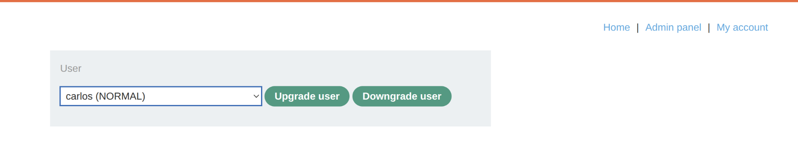
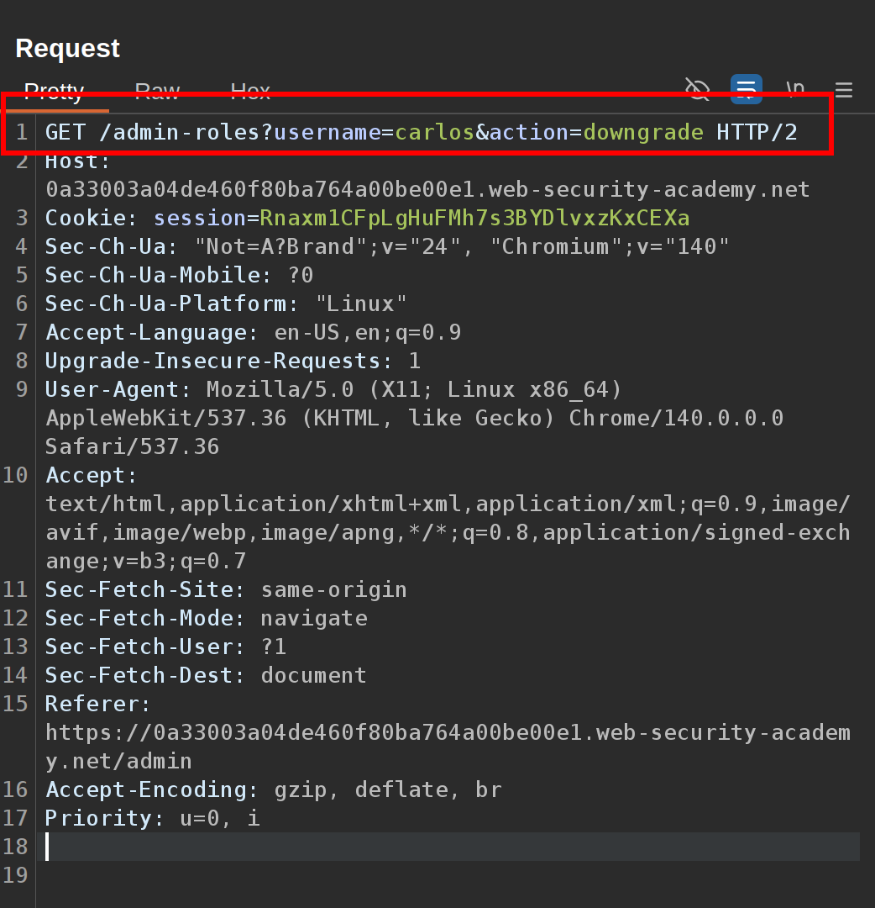
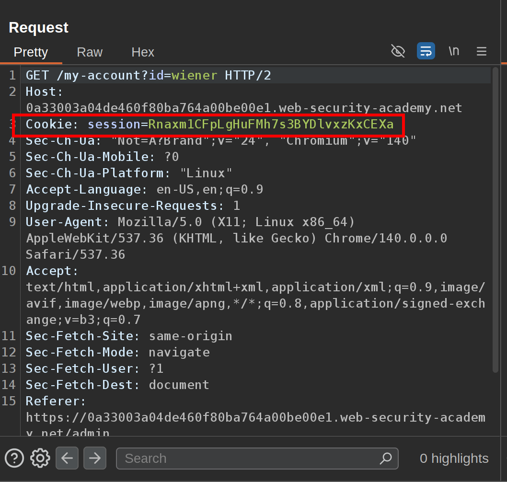
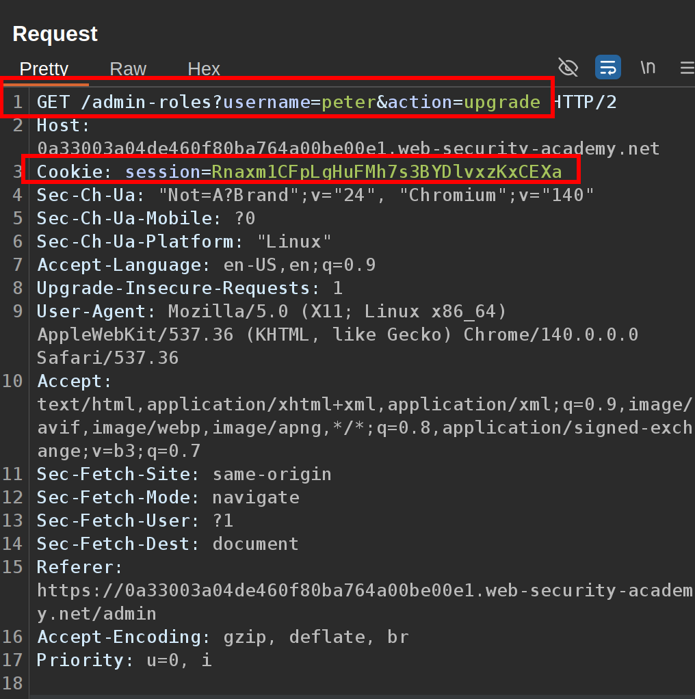

This lab controls access to certain admin functionality based on the Referer header. You can familiarize yourself with the admin panel by logging in using the credentials `administrator:admin`.

To solve the lab, log in using the credentials `wiener:peter` and exploit the flawed access controls to promote yourself to become an administrator.  
 1\. When you log in as administrator notice the request that activates the function to upgrade or downgrade an user is:  
   
   
 2\. Send the request to the repeater and hold it for a moment, then we are going to log in wiener:peter user and try to send the request again using this account's session cookie:  

  
 It means this request is not sanitized to be used just by users that have admin privileges.