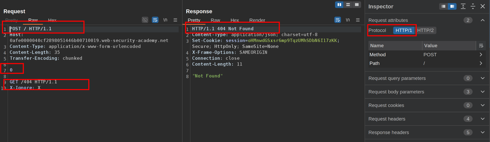

This lab involves a front-end and back-end server, and the front-end server doesn't support chunked encoding.

To solve the lab, smuggle a request to the back-end server, so that a subsequent request for `/` (the web root) triggers a 404 Not Found response.  
 **1.** Create a new POST request to receive a 404 response

