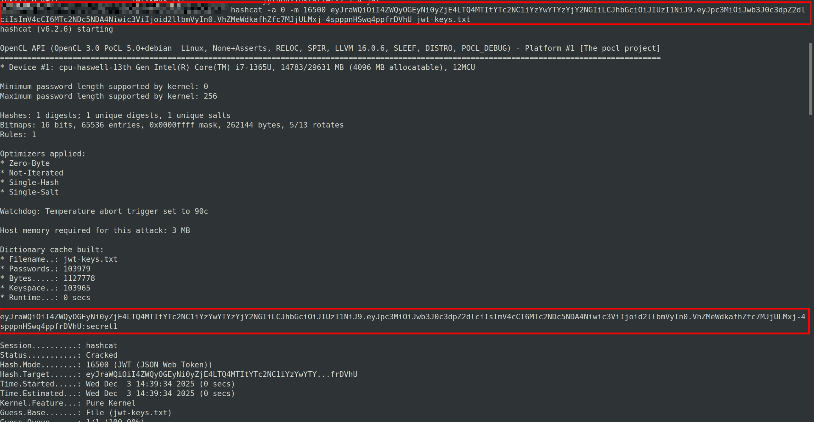
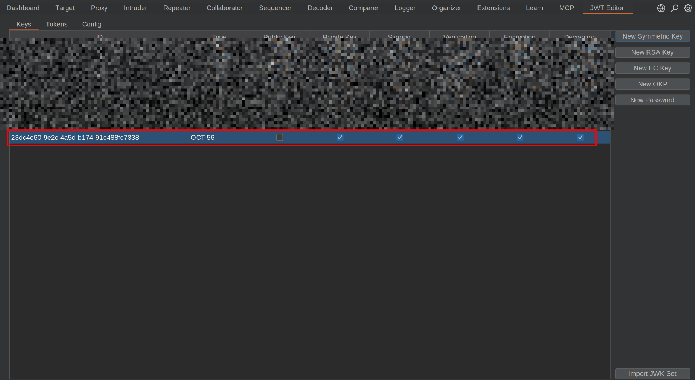
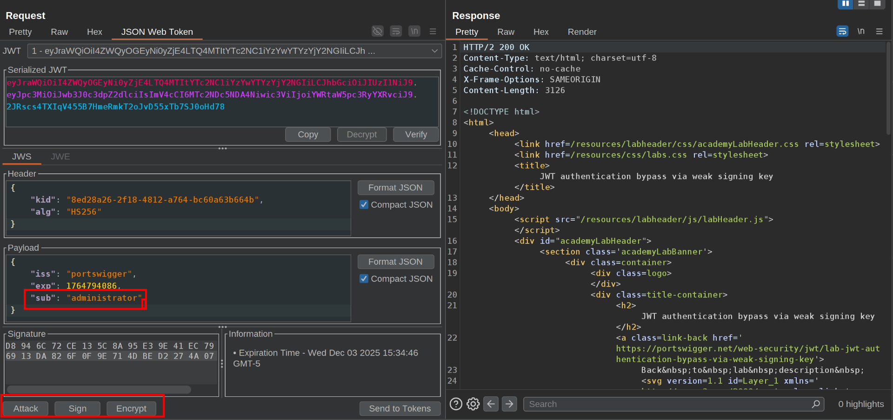
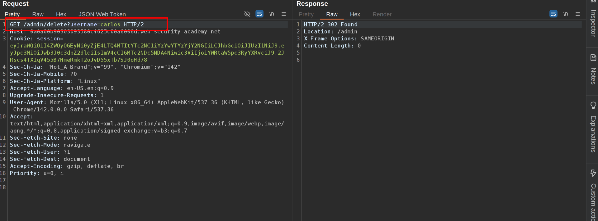

This lab uses a JWT-based mechanism for handling sessions. It uses an extremely weak secret key to both sign and verify tokens. This can be easily brute-forced using a [wordlist of common secrets](https://github.com/wallarm/jwt-secrets/blob/master/jwt.secrets.list).

To solve the lab, first brute-force the website's secret key. Once you've obtained this, use it to sign a modified session token that gives you access to the admin panel at `/admin`, then delete the user `carlos`.

You can log in to your own account using the following credentials: `wiener:peter`  
  1\. We are going to brute force the key: Log in to wiener account and copy the JWT   
2\. Using hashcat we are going to brute force it:   
 Using the list provided by burp: https://github.com/wallarm/jwt-secrets/blob/master/jwt.secrets.list  
 `hashcat -a 0 -m 16500 <YOUR-JWT> /path/to/jwt.secrets.list`  
   
  3\. With the secret cracked, we are going to use it to create a new key.  
4\. Go to burp decoder and encode the secret in base64 to get: c2VjcmV0MQ==  
5\. Create a new key, go to JWT editor and create a new symmetric key. Click generate. Replace the generated value for the `k` property with the Base64-encoded secret.  
   
 6\. Using the request /admin we are going to modify the JWT: change the sub to 'administrator.  
7\. At the bottom of the tab, click `Sign`, then select the key that you generated in the previous section.  
8\. Make sure that the `Don't modify header` option is selected, then click `OK`. The modified token is now signed with the correct signature.  
   
 9\. Send the request and observe that you have successfully accessed the admin panel.  
10\. In the response, find the URL for deleting `carlos` (`/admin/delete?username=carlos`). Send the request to this endpoint to solve the lab.  
 