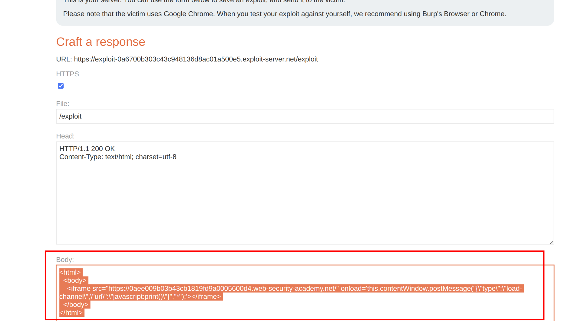

This lab uses web messaging and parses the message as JSON. To solve the lab, construct an HTML page on the exploit server that exploits this vulnerability and calls the `print()` function.  
  1\. Go to the exploit server and create payload like:  
   
 

`<html>`  
  `  <body>`  
    `    <iframe src="https://YOUR-LAB-ID.web-security-academy.net/" onload='this.contentWindow.postMessage("{\"type\":\"load-channel\",\"url\":\"javascript:print()\"}","*");'></iframe>`  
  `  </body>`  
`</html>`  
 

- The iframe loads the lab page.
    
- When loaded, it posts a crafted JSON message that triggers the site's logic.
    
- The vulnerable site attempts to set an iframe's src attribute to the value of the message's `"url"` parameter.
    
- Because the code does not properly validate or sanitize the JSON input, the payload `javascript:print()` gets executed in the context of the victim.  
     
    
    The payload `"{\"type\":\"load-channel\",\"url\":\"javascript:print()\"}"` is a JSON-formatted string sent via web messaging (postMessage) to exploit insecure JSON parsing and code handling in the target page.
    
    ## Payload Structure
    
    - The payload is parsed as JSON by the vulnerable page.
        
    - It creates an object with:
        
        - `"type": "load-channel"`: this tells the page to trigger a certain function or behavior (often related to loading something into an iframe).
            
        - `"url": "javascript:print()"`: this sets the value of a property that the page will use (often as the `src` of an iframe).  
              