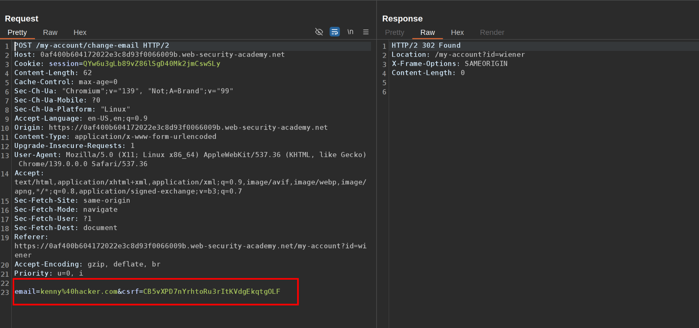
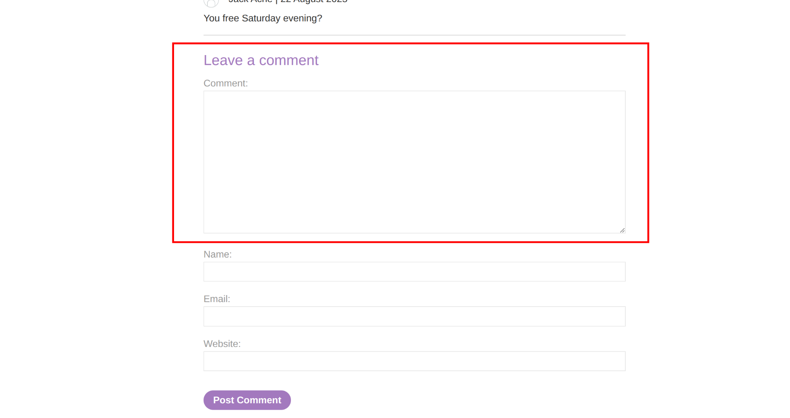

This lab contains a stored XSS vulnerability in the blog comments function. To solve the lab, exploit the vulnerability to steal a CSRF token, which you can then use to change the email address of someone who views the blog post comments.

You can log in to your own account using the following credentials: `wiener:peter`  
 **1- Notice there is a CSRF token and a parameter email when changing the email in your account**  
  
 **2- We are going to leave our stored XSS payload in the comment box**  
  
 **3- This is the payload, with it we are going to steal the csrf token from other user that visits the page**  
 ``  
 **4- What the payload does:**  
 Here’s what that payload is doing, line by line, and why it works in the Burp lab.

``  
With the token in hand, it builds a second request that performs a state-changing action (change email).

- It replays the CSRF token in the POST body so server-side CSRF defenses pass.
- Cookies again go automatically, so the action is done as the victim.

&nbsp;