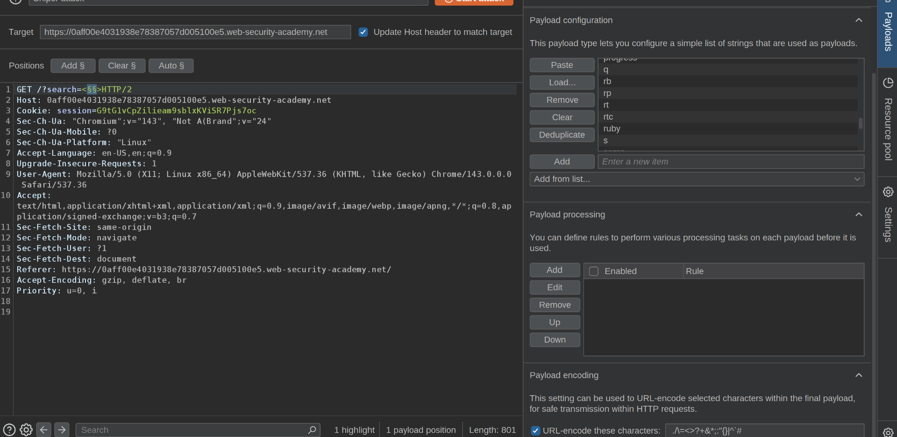
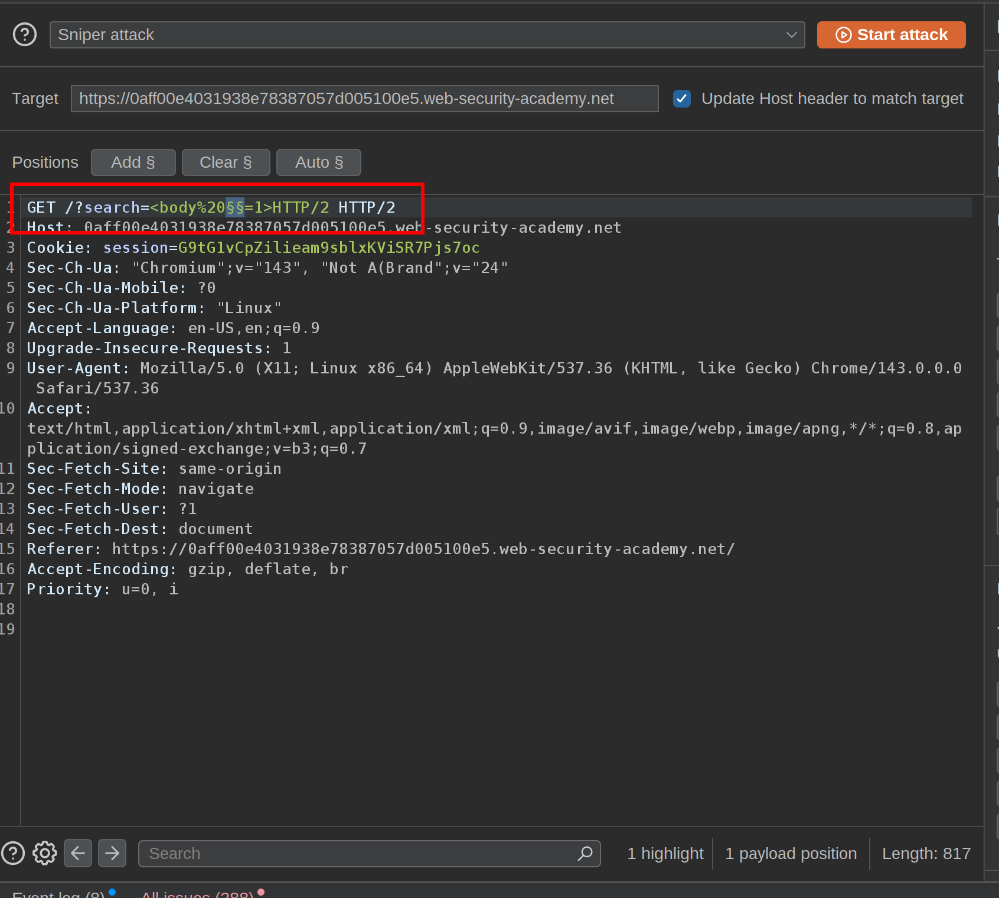

This lab contains a reflected XSS vulnerability in the search functionality but uses a web application firewall (WAF) to protect against common XSS vectors.

To solve the lab, perform a cross-site scripting attack that bypasses the WAF and calls the `print()` function.  
 1\. In the search tag we are going to use the intruder to check which tags are allowed:  
 First:   
And copy all the tags from the XSS cheat sheet  
We get that &lt;body&gt; is allowed  
 2\. Next we are going to put the intruder like:  
   
payload: &lt;body%20=1&gt;  
 And copy all the events from the XSS cheat sheet to clipboard. We get that onresize is allowed  
 3\. So at last we are going to use this payload for the exploit server:  
">&lt;body onresize=print()&gt;  
%22%3E%3Cbody%20onresize=print()%3E  
  &lt;iframe src="https://YOUR-LAB-ID.web-security-academy.net/?search=%22%3E%3Cbody%20onresize=print()%3E" onload=this.style.width='100px'&gt;