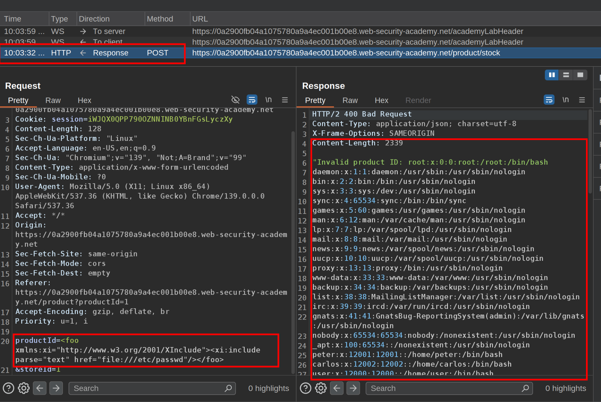

This lab has a "Check stock" feature that embeds the user input inside a server-side XML document that is subsequently parsed.

Because you don't control the entire XML document you can't define a DTD to launch a classic XXE attack.

To solve the lab, inject an `XInclude` statement to retrieve the contents of the `/etc/passwd` file.  
 1\. We are going to exploit this vulnerability in the check stock feature:  
  
 2\. We are going to intercept the request and change the ProductId with the payload:  
  
 `<foo xmlns:xi="http://www.w3.org/2001/XInclude"><xi:include parse="text" href="file:///etc/passwd"/></foo>`  
 **3\. Understanding the payload**  
 

#### 3.1. **XInclude Overview**

- **XInclude (XML Inclusion)** is a feature of XML parsers that allows you to include external XML or text files into an XML document dynamically.
    

Instead of defining an external DTD (like in a classic XXE attack), you use the `xi:include` element to tell the parser to fetch and include the content from a specified URI.  
 

#### 3.2. **`<foo>` Element**

`<foo ...> ... </foo>`

- - This is just a dummy container element you control.
        

You need a root element to wrap your `xi:include` tag because your input is only a **fragment** being inserted into a larger XML document.  
  

#### 3.3. **Namespace Declaration: `xmlns:xi="http://www.w3.org/2001/XInclude"`**

`xmlns:xi="http://www.w3.org/2001/XInclude"`

- This declares the **namespace** for the `xi` prefix.
    
- Without this, the parser wouldn’t recognize `<xi:include>` as a special XML directive.
    

It tells the XML parser: “Hey, this element is an XInclude directive, not just some random XML tag.”  
 

#### 3.4. **The XInclude Element**

`<xi:include parse="text" href="file:///etc/passwd"/>`

- `xi:include` is the actual directive that tells the parser to fetch content.

**Attributes:**

1.  `href="file:///etc/passwd"`
    
    - This is the file path to include.
        
    - `file:///` is a **file URI scheme** that loads a local file from the server.
        
2.  `parse="text"`
    
    - By default, XInclude tries to parse included content as XML.
        
    - Since `/etc/passwd` is **plain text**, we tell the parser to treat it as text instead of XML.
        

So, this directive tells the XML processor:

“Fetch the contents of `/etc/passwd` from the server’s file system and insert it here as raw text."  
 

### Why Use XInclude Here?

- Classic **XXE (XML External Entity)** attacks require defining a DTD (`<!DOCTYPE ...>`), but you **don’t control the entire XML document** in this lab—only part of it.
    
- XInclude works **without** needing to define a custom DTD.
    
- This makes it perfect for scenarios where you can inject XML fragments but not modify the XML declaration or DOCTYPE.