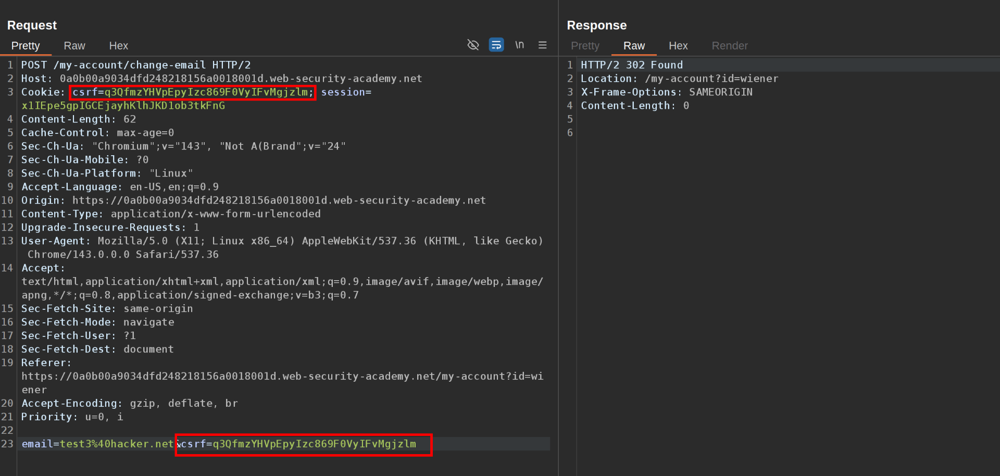
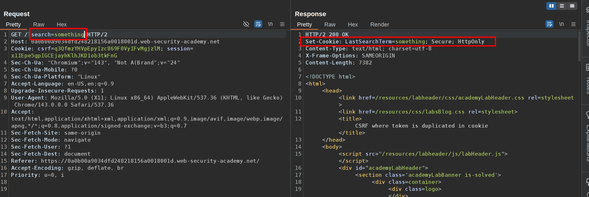
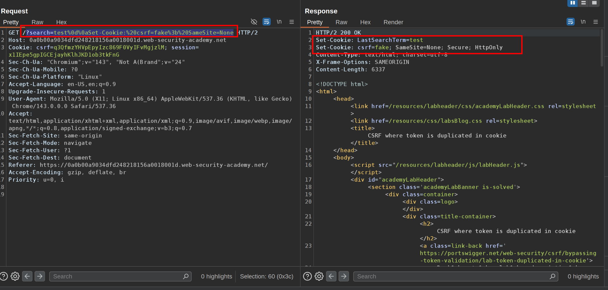
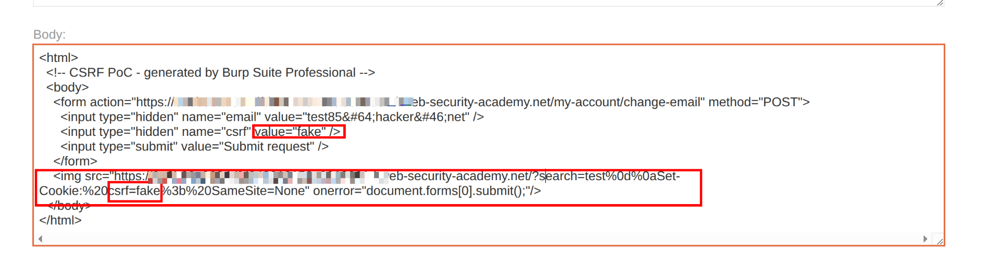

This lab's email change functionality is vulnerable to CSRF. It attempts to use the insecure "double submit" CSRF prevention technique.

To solve the lab, use your exploit server to host an HTML page that uses a CSRF attack to change the viewer's email address.

You can log in to your own account using the following credentials: `wiener:peter`  
 1\. Notice that there are two csrf tokens in the requests:  
   
 It validates the two are the same to accept the request.  
 2\. Notice that when you search a term it reflects the term in the Set-cookie response header   
   
 3\. So what we can do is create a fake csrf cookie so it reflects in the Cookie: request. Use this payload:  
`?search=test%0d%0aSet-Cookie:%20csrf=fake%3b%20SameSite=None`. See how it gets reflected:  
   
 4\. Create CSRF POC in the change email request and ensure the csrf is 'fake'. Change the &lt;script&gt;....&lt;/script&gt; section to  ``. Store the exploit and deliver it to the victim  
 