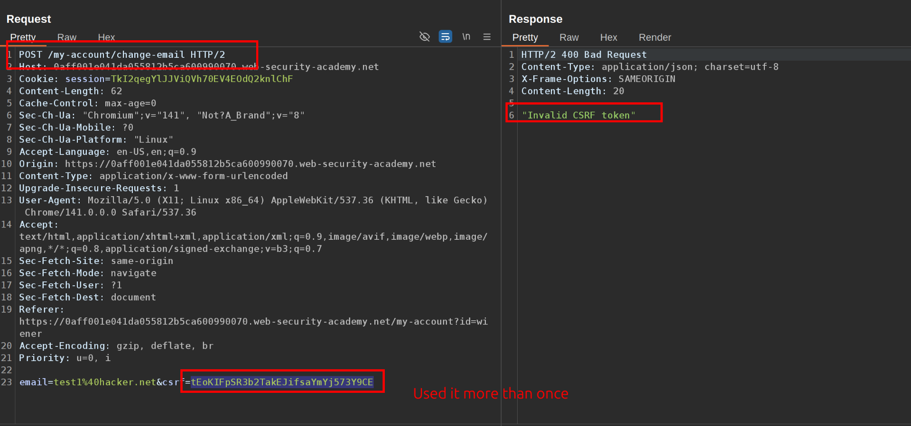
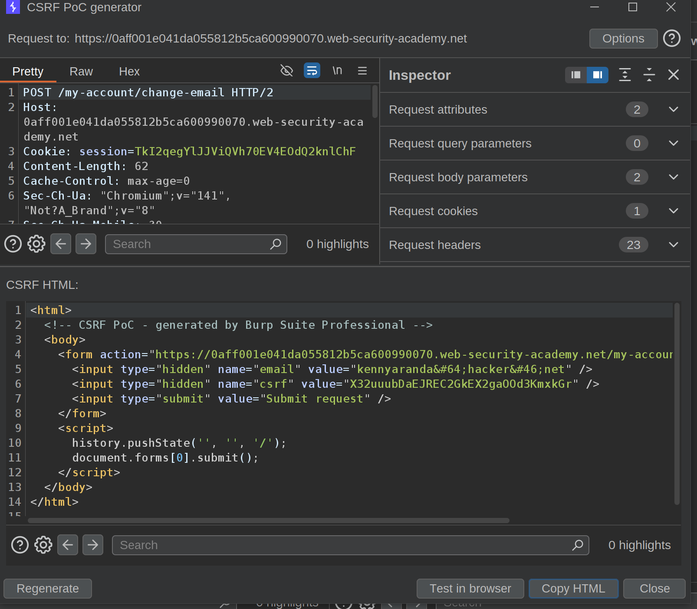
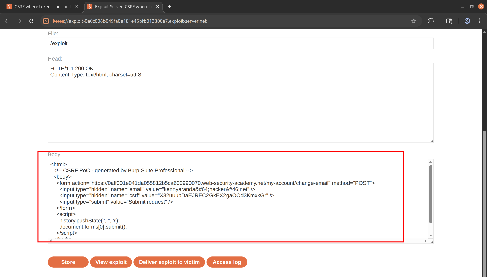

This lab's email change functionality is vulnerable to CSRF. It uses tokens to try to prevent CSRF attacks, but they aren't integrated into the site's session handling system.

To solve the lab, use your exploit server to host an HTML page that uses a CSRF attack to change the viewer's email address.

You have two accounts on the application that you can use to help design your attack. The credentials are as follows:

- `wiener:peter`
- `carlos:montoya`

&nbsp;

1\. Log in to any account and notice the csrf token is necessary to send the change-email request, you cannot use it twice either.  
   
  2\. Intercept a request and copy the csrf token, drop the request and generate a new CSRF-POC with this token that was never used.  
 Change the email, use it in your exploit server, and send it to victim.  
    
    
   