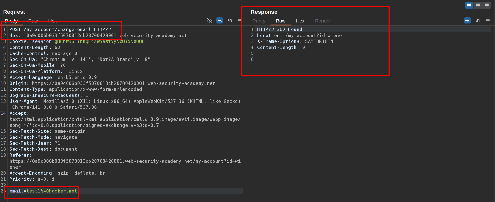
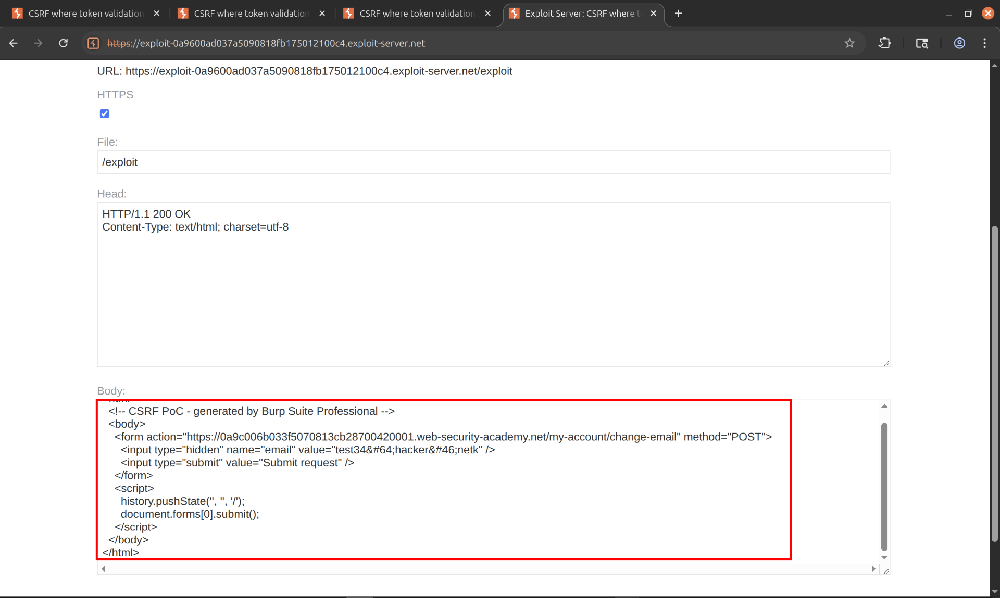

This lab's email change functionality is vulnerable to CSRF.

To solve the lab, use your exploit server to host an HTML page that uses a CSRF attack to change the viewer's email address.

You can log in to your own account using the following credentials: `wiener:peter`  
  1\. We are going to the change email functionality and notice it sends a csrf token, but if we delete it we can send it and get a 302 response  
   
 3\. Right-click and generate CSRF-POC, paste in the exploit server, change the email to one different than yours and send it to the victim  
   
 