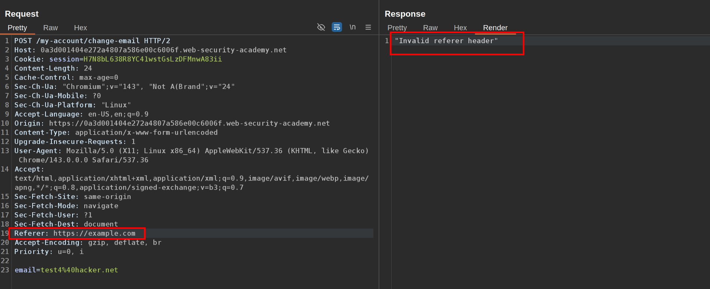
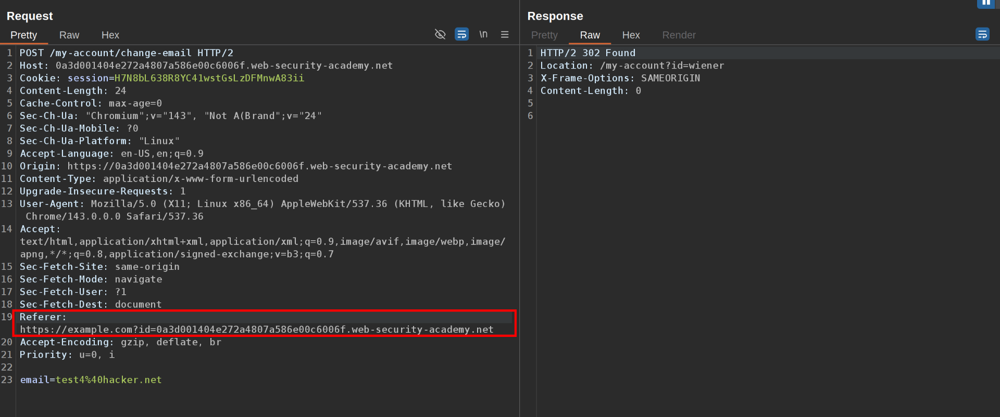
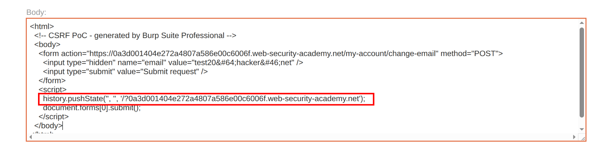
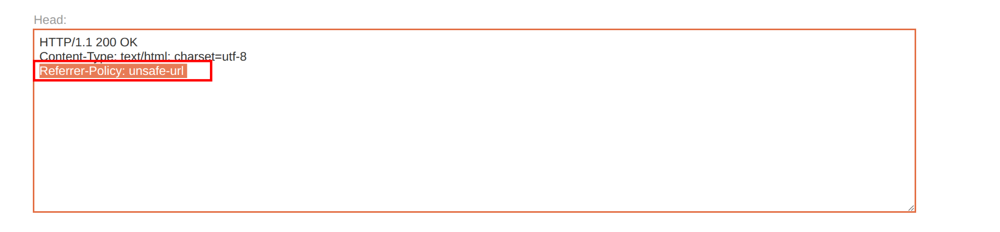

This lab's email change functionality is vulnerable to CSRF. It attempts to detect and block cross domain requests, but the detection mechanism can be bypassed.

To solve the lab, use your exploit server to host an HTML page that uses a CSRF attack to change the viewer's email address.

You can log in to your own account using the following credentials: `wiener:peter`  
 1\. Go to the change email request and try to change the referer header, see that it rejects the request  
   
 2\. Try adding your lab ID as a parameter of the referer URL and now it accepts it:  
   
 3\. Generate your POC CSRF in the exploit server and add your lab id to the history.pushState('', '', ','); third parameter.

  
 And also add to the head section `Referrer-Policy: unsafe-url`  
   
 4\. Store the exploit and deliver it to the victim

  
  