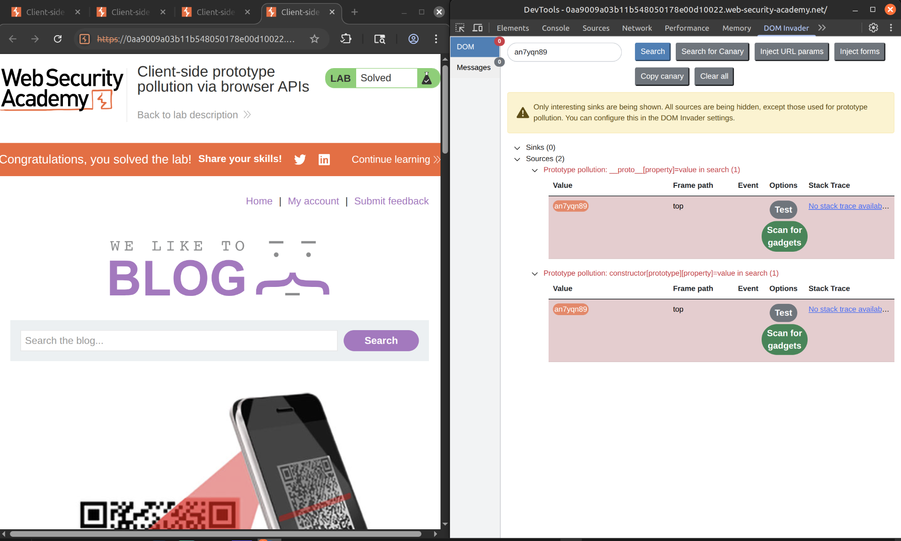
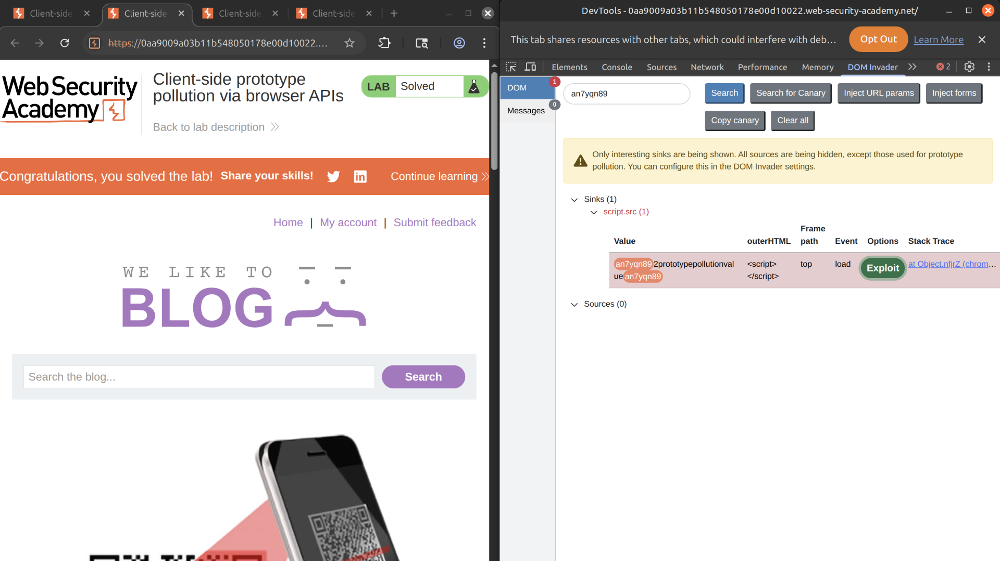

This lab is vulnerable to DOM XSS via client-side prototype pollution. The website's developers have noticed a potential gadget and attempted to patch it. However, you can bypass the measures they've taken.

To solve the lab:

1.  Find a source that you can use to add arbitrary properties to the global `Object.prototype`.
    
2.  Identify a gadget property that allows you to execute arbitrary JavaScript.
    
3.  Combine these to call `alert()`.
    

&nbsp;

&nbsp;

1\. Go to inspector panel > DOM invader and in the search option notice that the DOM invader found an prototype pollution. Press 'Scan for gadgets'  
   
 2\. This will open a new tab, once the scan is over open again the inspector panel and notice that there is an exploit option, press it and it will call the alert function to solve this lab  
 