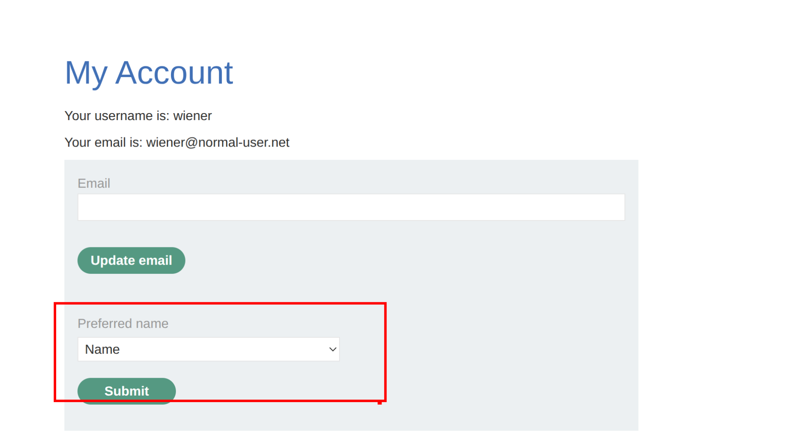
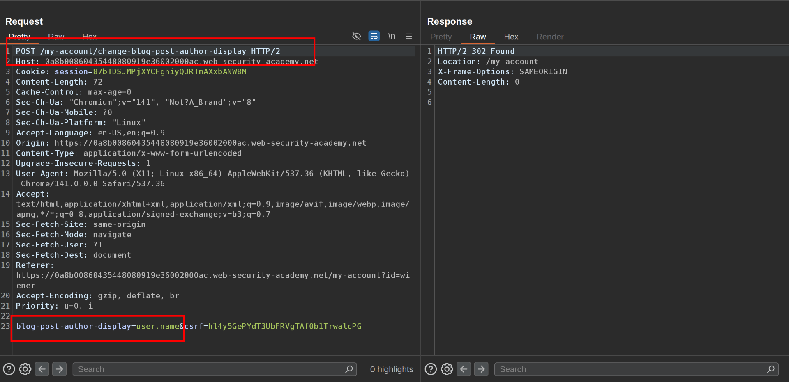
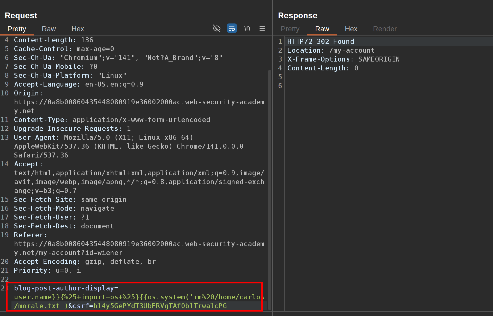

This lab is vulnerable to server-side template injection due to the way it unsafely uses a Tornado template. To solve the lab, review the Tornado documentation to discover how to execute arbitrary code, then delete the `morale.txt` file from Carlos's home directory.

You can log in to your own account using the following credentials: `wiener:peter`  
  1\. Notice there is a functionality to change the preferred name:  
   
 2\. It creates this request:  
  
 3\. It uses Tornado template insecurely and studying it you can view that it can execute python code using the payload to delete morale.txt file:   
 ` {{os.system('rm /home/carlos/morale.txt')`

