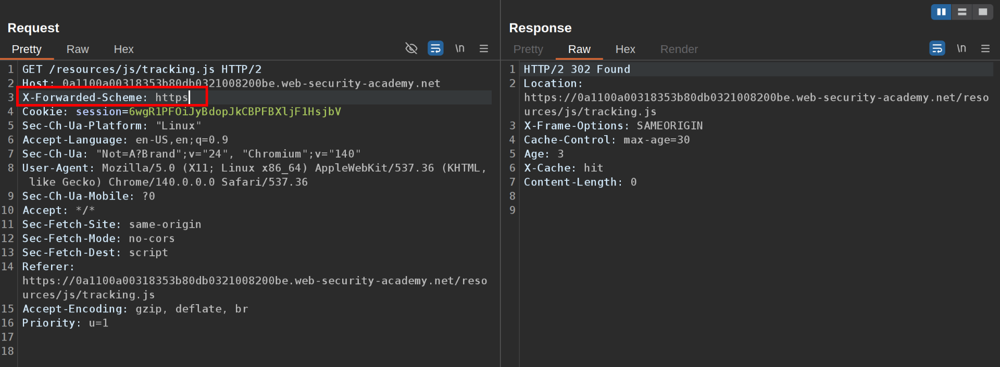

This lab contains a web cache poisoning vulnerability that is only exploitable when you use multiple headers to craft a malicious request. A user visits the home page roughly once a minute. To solve this lab, poison the cache with a response that executes `alert(document.cookie)` in the visitor's browser.  
  1\. Notice this curious request:  
   
 2\. Try to poison the headers:  
 **X-Forwarded-Host:  
**This header identifies the original host requested by the client in the Host HTTP request header. It is added by a proxy or load balancer because, as requests pass through intermediaries, the Host header can change, and the backend might need to know the actual hostname the user accessed. Helps in scenarios with virtual hosting, so the backend can route requests properly, generate correct links, or log the original host accessed.  
 Example: `X-Forwarded-Host: example.com`  
 **X-Forwarded-Scheme****:  
**This header tells the backend what protocol (HTTP or HTTPS) was originally used by the client, even if the proxy itself modified the connection type. Useful for web applications to generate absolute URLs or redirects with the correct scheme, and for security-sensitive features (e.g., knowing if the initial connection was secure).  
 Example: `X-Forwarded-Scheme: https`  
 \- X-Forwarded-Host:  
use a payload like example.com, nothing happens and the webpage responds the same  
   
 \- X-Forwarded-Scheme  
use a payload like https, the respond will be 302 Found  
   
 \- Now try with both headers, but this time `X-Forwarded-Scheme: nohttps` and notice it responds with a 302 Found, but this time the Location: is example.com  
   
 3\. Exploit:  
Go to exploit server and create a payload like alert(document.cookie) to the directory /resources/js/tracking.js, store it  
   
 In the request change the X-Forwarded-Host to your exploit server Domain and leave the X-Forwarded-Scheme as nohttps   
   
 You will get a 302 Found response, try this until you get a X-Cache: hit  
  
 4\. Wait for the victim:  
Go to the home page, load it and wait until the victim loads the page and solve the lab  
  

## Why the Exploit Works

- The vulnerability comes from the server’s logic that mishandles both `X-Forwarded-Host` and `X-Forwarded-Scheme`, allows user input into redirection and caching decisions, and doesn’t properly separate cache keys by those header values
    
- Attackers abuse this by injecting a malicious host (pointing to their payload) and scheme, tricking the cache into storing and serving a harmful script to legitimate users.
    

Each of these steps is necessary because the cache only accepts poisoned responses when both headers are manipulated together; otherwise, the separate use of each header would either have no effect or not result in a cacheable response, leaving the application vulnerable to cache poisoning.